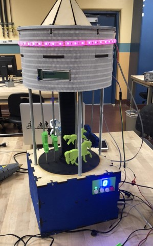

## ECE 188 LabVIEW Carousel


```
Isometric view of the carousel
```


## Description
[Link to PDF](https://drawsome1.github.io/Carousel/Elevator Project Description.pdf)

## Collaborators
**Richard Chum**

**Derek Lam**

**Jasmine Chiang**


## Objective
Design and construct a mechincal system using National Instruments hardware 
[LabVIEW](www.ni.com/en-us/shop/labview.html) software. 

System's design is constrained to have at least three stages, fit within a 
10"x10"x22" space, and contain at least seven of the modules listed below:
* LCD Screen
* DC Motor with Encoder
* Stepper Motor
* Micro Servos
* IR Distance Sensor
* Buttons
* LEDs
* Seven Segment Display
* Piezo Buzzer
* Limit Switch

## Materials
* 6 sheets commulatively of
	+ Plywood (12"x24"x 1/8" or 1/4 ")
	+ Acylic (12"x24"x 1/8" or 1/4 ")
* Threaded rods (22"x 3/8")
* Smooth rods (22"x 1/4")
* Pulleys (1" diameter)
* Twine/Nylon string
* 1.75mm filament for 3D printer
* And anything you request or buy on your own


## Key highlights


## Demonstartion


